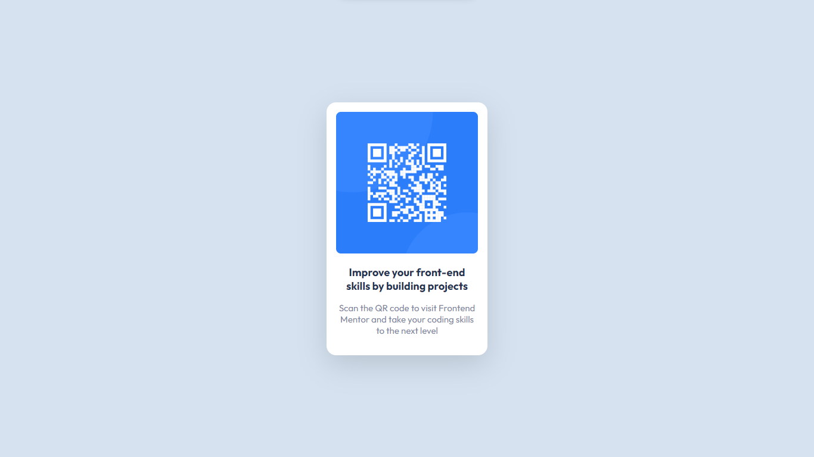

# Frontend Mentor - QR code component solution

This is a solution to the [QR code component challenge on Frontend Mentor](https://www.frontendmentor.io/challenges/qr-code-component-iux_sIO_H). Frontend Mentor challenges help you improve your coding skills by building realistic projects. 

## Table of contents

- [Overview](#overview)
  - [Screenshot](#screenshot)
  - [Links](#links)
- [My process](#my-process)
  - [Built with](#built-with)
  - [What I learned](#what-i-learned)
  - [Continued development](#continued-development)
  - [Useful resources](#useful-resources)
- [Author](#author)

**Note: Delete this note and update the table of contents based on what sections you keep.**

## Overview

### Screenshot




### Links

- Solution URL: [Github Repo](https://github.com/ayaantuts/QR-Code-Frontend-Mentor)
- Live Site URL: [Github Pages](https://ayaantuts.github.io/QR-Code-Frontend-Mentor/)

## My process

### Built with

- Semantic HTML5 markup
- CSS custom properties
- Flexbox
- Mobile-first workflow

### What I learned

I've learned how to use the CSS custom properties and how to use the flexbox. I've also learned how to use the media queries to make the website responsive.

To see how you can add code snippets, see below:

```html
<h1>I love HTMl</h1>
```
```css
.proud-of-this-css {
  content: "CSS is awesome!";
}
```
```js
const proudOfThisFunc = () => {
  console.log('JS is fun!')
}
```

### Continued development

I want to continue focusing on the CSS custom properties and the flexbox. I also want to learn how to use the grid layout and the CSS animations.

### Useful resources

- [CSS Custom Properties](https://developer.mozilla.org/en-US/docs/Web/CSS/--*) - This helped me to learn about the CSS custom properties.

- [Flexbox](https://developer.mozilla.org/en-US/docs/Web/CSS/flex) - This helped me to learn about the flexbox.

- [Media Queries](https://developer.mozilla.org/en-US/docs/Web/CSS/Media_Queries/Using_media_queries) - This helped me to learn about the media queries.

## Author

- Website - [Add your name here](https://www.github.com/ayaantuts)
- Frontend Mentor - [@ayaantuts](https://www.frontendmentor.io/profile/ayaantuts)